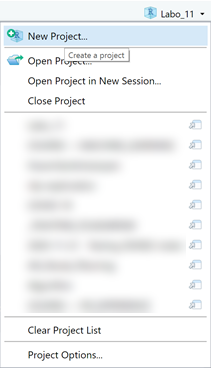
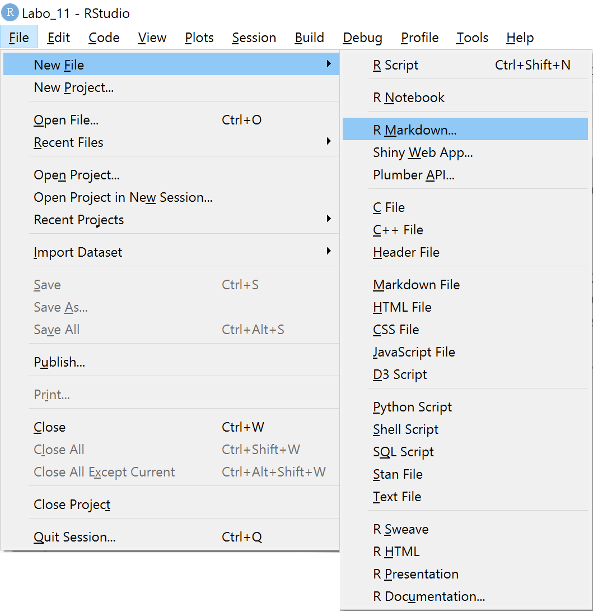
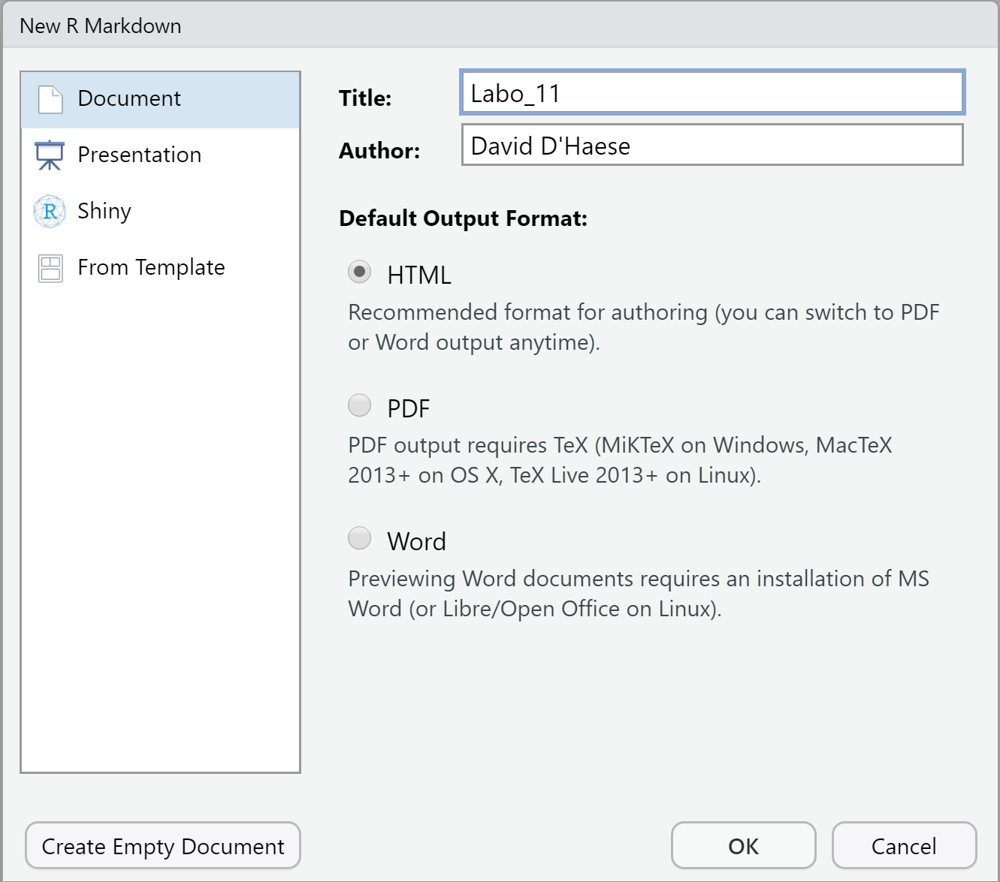

```{r setup, include=FALSE}
knitr::opts_chunk$set(echo = TRUE)
```

## Doel van dit labo

In dit labo gaan we leren om in een multi-language omgeving en door middel van een simpel neuraal netwerk te voorspellen hoe druggebruikers evolueren.

## Case study: Voorspellen herstel van druggebruik

De dataset is afkomstig van een klinische studie genaamd _Health evaluation and linkage to primary care_ (_HELP_; @samet2003linking) en werd verzameld door [Prof. Dr. Nicholas Horton](https://nhorton.people.amherst.edu/) aan de Amherst College in Massachusetts. Bij druggebruikers werd gedurende twee jaren om de 6 maanden een uitgebreide vragenlijst voorgelegd.

## Vraagstelling

De vraag in de huidige analyse is als volgt:

> In hoeverre (hoeveel maanden op voorhand) kan men, op basis van de antwoorden op de vragenlijst, voorspellen hoe gelukkig de druggebruiker in de toekomst zal zijn.

## RStudio

Hier is hoe je een nieuwe Markdown rapport opzet in een nieuw R project:







## De pakketten

Voor het manipuleren van de data zijn er een aantal extra pakketten nodig di je moet installeren:

```{r pakketten}
library(data.table)
library(magrittr)
library(mosaicData)
library(reticulate)
library(knitr)
library(zoo)
```

Je kan `install.packages` gebruiken of de 'Packages' tab van RStudio gebruiken.

## De data

We kunnen de data rechtstreeks in R laden. De dataset dateert van vóór de `data.table`-periode, dus moeten we deze even omzetten.

```{r}
set.seed(42)

abuse <- HELPfull %>% data.table
abuse %>% head %>% kable
```

De dimensies van de dataset zijn nogal bijzonder en ideaal voor een NN: `r abuse %>% dim %>% paste0(collapse = " &times; ")`. De belangrijkste variabelen zijn `ID`, die een persoon identificeert, `TIME` dat aangeeft op welke tijdstip de enquête werd afgenomen en `B9H` dat als afhankelijke variabele wordt aangeduid en dat aangeeft hoe ontevreden de persoon zich de voorbije 4 weken voelde (zie _dat\dictionary.xls_ voor meer details). Alle andere variabelen zijn de antwoorden op tal van andere vragen.

## Klaarstomen van de data

Omdat hier de focus niet ligt op data mining, krijgt je dit hier cadeau. De bedoeling is om bijvoorbeeld de antwoorden van op `TIME == 0` en `TIME == 6` te gebruiken om de `B9H[TIME == 24]` te voorspellen. Eerst gaan we de niet-numerieke variabelen weglaten (voor de eenvoud en omdat het er erg weinig zijn) en moet de data een nieuwe vorm krijgen (eng: _reshape_) met de `dcast` functie.

```{r casting}
keep <- colnames(abuse)[abuse %>% lapply(class) %in% c("numeric", "integer")]
abuse <- abuse %>% 
  extract(, keep, with = FALSE) %>%
  dcast(ID ~ TIME, value.var = names(.) %>% setdiff(c("ID", "TIME")))
```

Het moeilijke aan dit soort data is dat er geleidelijk mensen uit de studie wegvallen en dat bovendien de vragen variëren tussen de tijdstippen onderling. Als gevolg zijn er na de bovenstaande reshape-operatie kolommen met enkel lege waarden in, en daar zit geen informatie in, dus die gaan we verwijderen. Dan blijven er nog steeds individuele waarden die `NA` zijn (_not available_) en dis gaan we voor het gemak vervangen door de kolom-gemiddelden.

```{r drop}
drop <- colnames(abuse)[abuse %>% is.na %>% not %>% colSums %>% equals(0)]

nonempty <- abuse %>% names %>% setdiff(drop)

abuse <- abuse[, nonempty, with = FALSE] %>% na.aggregate
```

Nu rest ons om de antwoorden van de eerste twee bevragingen samen te nemen om de x te definiëren:

```{r x}
nonempty_x <- grep("_(0|6)$", nonempty, value = TRUE)
nonempty_x <- nonempty_x[!grepl("B9H", nonempty_x)]

abuse_x <- abuse[, nonempty_x, with = FALSE]
```

We splitsen de data set in een (training + validatie)-set van 80% en een test-set van 20%.

```{r split}
trn_set <- abuse %>% nrow %>% runif %>% is_less_than(4/5)

x_trn <- abuse_x[trn_set]
x_tst <- abuse_x[!trn_set]
```

Rest ons nog om de y te definiëren. Het gaat hier om een ordinale variabele dat oorspronkelijk gecodeerd werd met de waarden 1 (~altijd tevreden) tot 6 (~nooit tevreden). Hier worden de waarden gemakshalve genormaliseerd binnen het bereik [0, 1] en omgezet naar een maat voor tevredenheid.

```{r norm-y}
y_trn <- abuse[trn_set, 1 - (B9H_24 - 1) / 5]
y_tst <- abuse[!trn_set, 1 - (B9H_24 - 1) / 5]
```

## Trainen van het NN

Nu is het aan jullie. De opdracht is kort en bondig: Werk een NN uit die aan de vraagstelling beantwoord. Voor diegenen die in een andere omgeving willen werken, de training- en testing datasets kan je als volgt exporteren:

```{r eval=FALSE}
cbind(y_trn, x_trn) %>% fwrite("dat/trn.tsv", sep = "\t")
cbind(y_tst, x_tst) %>% fwrite("dat/tst.tsv", sep = "\t")
```

je zal nog de juiste verliesfunctie moeten uitkiezen, zie [Keras hulppagina](https://keras.io/api/losses/) om de juiste keuze te maken. Dan is het een kwestie om 'te spelen' met de variabelen om eens te zien wat er gebeurt (of niet gebeurt).

```{python antwoord, eval=FALSE}
import numpy as np
from keras.models import Sequential
from keras.layers import ...
from keras.callbacks import TensorBoard
from datetime import datetime

log_dir = "tf/"+ (datetime.now()).strftime("%Y-%m-%d_%H.%M.%S")
model = Sequential()

model.add(...(..., input_shape=[r.x_trn.shape[1]]))
model.add(...)
model.add(Dense(1, activation = "sigmoid"))

model.compile(loss = "...", optimizer = "adam", metrics = ["accuracy"])
 
accuracy = model.fit(
  np.asarray(r.x_trn),
  np.asarray(r.y_trn),
  epochs = ...,
  batch_size = ...,
  validation_split = ...,
  verbose = 0,
  callbacks = [TensorBoard(log_dir = log_dir)])

predictions = model.predict(np.asarray(r.x_tst))
```

## Resultaat

Daarna kan je in R het resultaat visualiseren. Hieronder is een eerste aanzet met snelle statistieken en plots, maar je hoeft deze niet per sé te gebruiken

```{r evaluatie, eval=FALSE}
py$accurcy$history %>%
  as.data.table %>%
  extract(, .(accuracy, val_accuracy)) %>%
  ts %>% 
  plot (main = "Evolution of accuracy")

py$predictions %>% cbind(y_tst) %>% plot

cor(py$predictions, y_tst)
```

## Opdracht indienen

Je moet op Digitap een RMarkdown-bestand indienen + screenshots van Tensorboard, maar zónder de data opnieuw op te laden.

## Referenties
